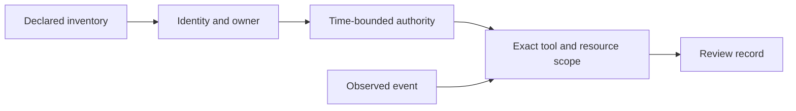

# AI Agent Governance Lab

**Connect an agent's observed action to its declared identity, owner, authority,
and permitted tool scope.**

An experimental offline reference lab. All agents, identities, approvals,
tools, and events are synthetic. The program reviews supplied fixtures;
it does not discover agents on a network or connect to an MCP server.



## Run it

Python 3.10 or later, with no third-party dependencies:

```sh
python lab.py --output output/review.json
python -m unittest discover -s tests -v
```

| Event | What changed | Expected result |
|---|---|---|
| `event-001` | Registered agent searches its allowed catalog | `WITHIN_DECLARED_SCOPE` |
| `event-002` | Same agent attempts an unlisted delete tool | `OUTSIDE_DECLARED_SCOPE` |
| `event-003` | Local runtime lacks an owner and authority | `UNKNOWN` |
| `event-004` | Agent is absent from the inventory | `UNKNOWN` |

Change [inventory.json](fixtures/inventory.json) or [events.json](fixtures/events.json),
or use `--inventory`, `--events`, and `--at` to provide alternative synthetic
inputs. The default review time is **2026-01-15T12:00:00Z** for repeatability.

## Review semantics

This is a **historical event review**. Declared authority must have been active
when the event occurred; a later expiry does not rewrite the historical result.
Future observations, missing owners, ambiguous identifiers, invalid timestamps,
malformed permissions, and identity mismatches cannot produce an in-scope result.
Tool and resource matching is exact; there is no wildcard expansion.

Each result preserves its event, authority ID, status, and reasons. A matching
declaration is not proof of legitimate authorization: real systems need
independently authenticated approvals and event sources. A result never grants
access, revokes a token, or invokes a tool.

## Applying the model

The inventory shape can describe a service principal, local model runtime,
MCP client, or hosted agent. A future collector would need to bind discovered
instances to accountable owners and separately authenticated authority records.
Agent-to-agent delegation, token audience checks, revocation history, policy
versioning, and tamper-evident retention are outside this initial release.

## References and related work

- [NIST AI RMF](https://www.nist.gov/itl/ai-risk-management-framework)
- [NIST SP 800-207](https://csrc.nist.gov/pubs/sp/800/207/final)

See [NOTICE.md](NOTICE.md) for publication scope and licensing status.

- [control-evidence-schema](https://github.com/csingcloud/control-evidence-schema) — A draft JSON Schema for time-bounded control evidence, with synthetic examples and validation.
- [public-sector-ai-controls](https://github.com/csingcloud/public-sector-ai-controls) — Machine-readable control references and illustrative mappings for public-sector AI governance.
- [continuous-authorization-lab](https://github.com/csingcloud/continuous-authorization-lab) — A runnable synthetic lab showing how changing evidence affects a privileged-access review.
- [security-control-detections](https://github.com/csingcloud/security-control-detections) — Control-oriented KQL hunting and evidence queries for Microsoft Sentinel and Defender XDR.

More about Cerydora: [cerydora.com](https://cerydora.com).
